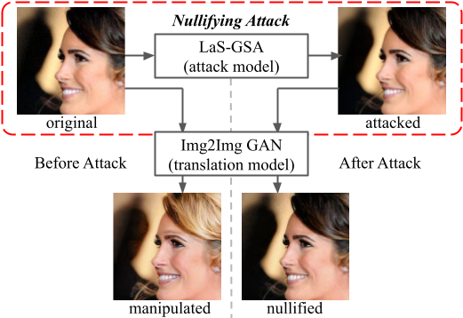

# Attack as the Best Defense: Nullifying Image-to-image Translation GANs via Limit-aware Adversarial Attack

We develop a black-box adversarial attack method against potential deepfake models based on image-to-image translation GANs utilizing 3 optimization tricks.


Paper: [paper pdf](docs/ready.pdf) to appear at ICCV 2021.

## Citation
If you find this work or code is helpful in your research, please cite our work:
```
@inproceedings{yeh2021attack,
  title={Attack as the Best Defense: Nullifying Image-to-image Translation GANs via Limit-aware Adversarial Attack},
  author={Yeh, Chin-Yuan and Chen, Hsi-Wen and Shuai, Hong-Han and Yang, De-Nian and Chen, Ming-Syan},
  booktitle={Proceedings of the IEEE/CVF International Conference on Computer Vision},
  year={2021}
}
```
## Contact

If you have any questions, feel free to open an issue or directly contact me via: `marrch30@gmail.com`  